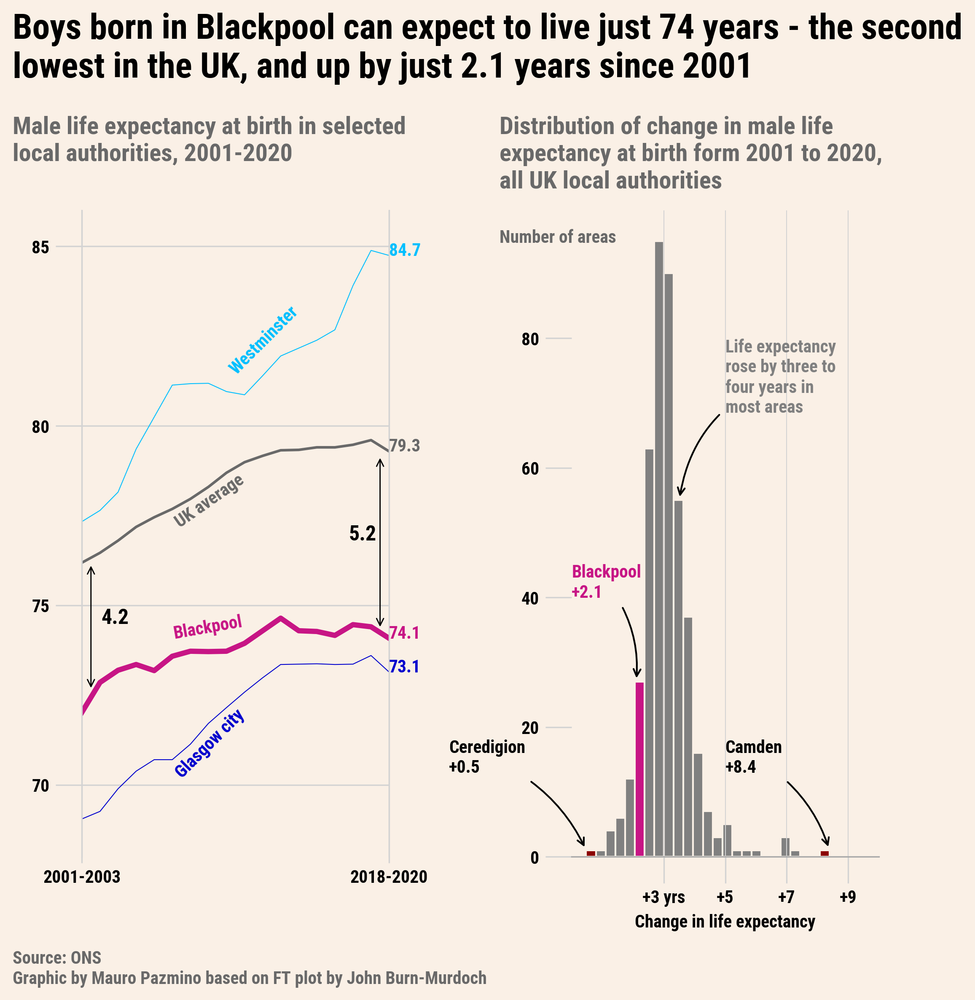
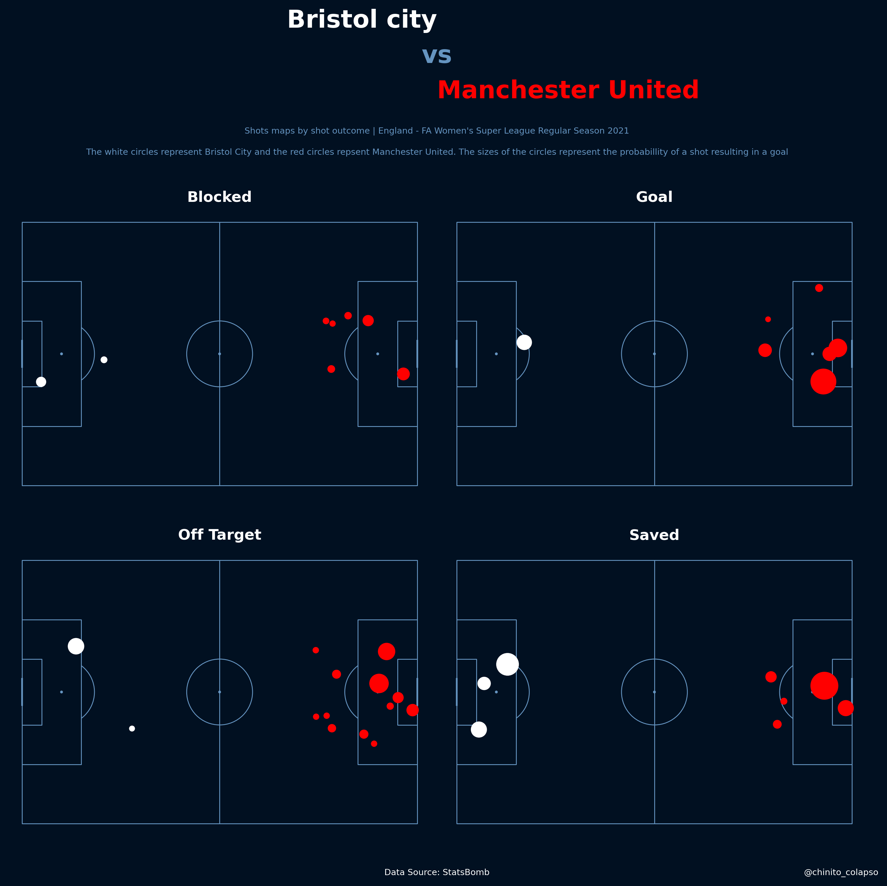
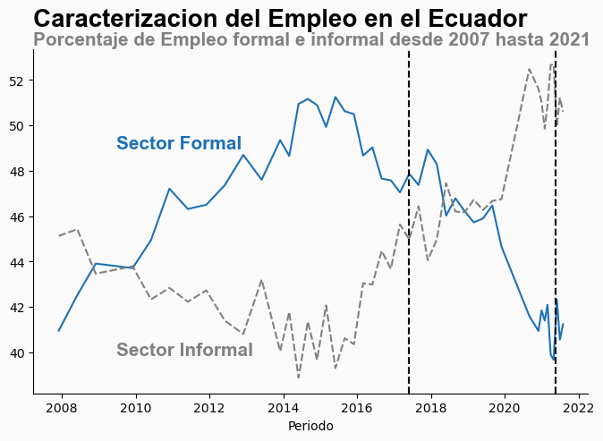
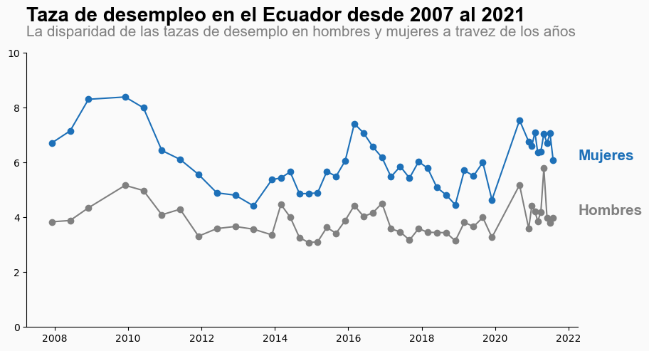
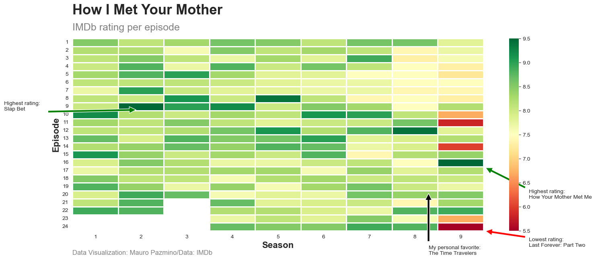
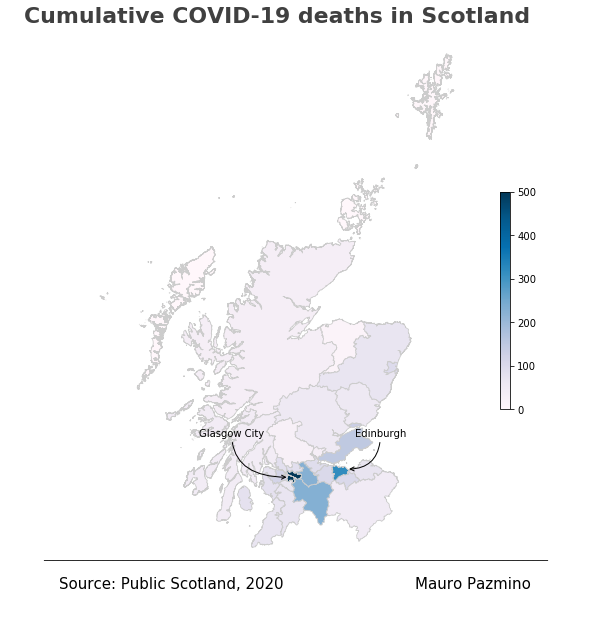

<h1 style="font-weight:normal" align="center">
  &nbsp;Data viz side projects&nbsp;
</h1>

Repository with all my data visualization side projects using python and R
***

## ⚽️ Life expectancy in the UK
My attempt in recreate a plot about life expectancy in the UK from the Financial Times [Code](https://github.com/maurocolapso/Data_viz/tree/main/Life-expectancy/Life_expectancy_UK_FT.py)

## ⚽️ Footbal pitch using Python
A little fun challenge I found on twitter. Defintely easier to do using R but it is possible with Python. [Code](https://github.com/maurocolapso/Data_viz/tree/main/Footbal/Football.py)

## 🇪🇨 Ecuador unemployment rate
Plots of formal and informal work and also unemployemnt rate through the last 14 years (in Spanish). [Code](https://github.com/maurocolapso/Data_viz/tree/main/Ecuador)

## How I Met Your Mother episode rating
Heatmap with the rating of each episode across all seasons. Sadly, nobody liked the final episode (I loved it).

The code to scrape the data from IMDb was adapted from Isabella Benabaye [post](https://towardsdatascience.com/scraping-tv-show-epsiode-imdb-ratings-using-python-beautifulsoup-7a9e09c4fbe5) on Medium. [Code](https://github.com/maurocolapso/Data_viz/tree/main/HIMYM-rating)

## 😷 Covid cases in Scotland
Plot of COVID-19 cases and 7 day rolling window in the style of BBC. Data from the summer of 2020. [Code](https://github.com/maurocolapso/Data_viz/tree/main/Covid-cases-Scotland-(BBC-style)/Covid-cases-scotland-bbc-style.py)
/Covid_cases_scotlandBBC.png)

## 😷 Covid deaths on map
Map of covid deaths for each council. 

## Bar chart race
Barchart race using historic temperature data from Scotland.
[code](https://github.com/maurocolapso/Data_viz/tree/main/bar-race-max-min-temp-Glasgow)

https://github.com/maurocolapso/Data_viz/blob/main/bar-race-max-min-temp-Glasgow/max_min_temperatures_glasgow.html

